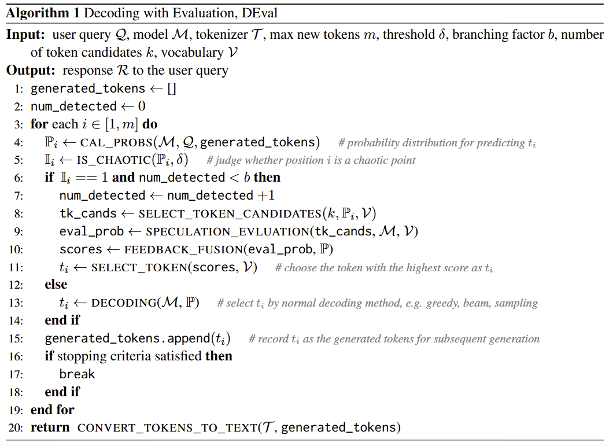
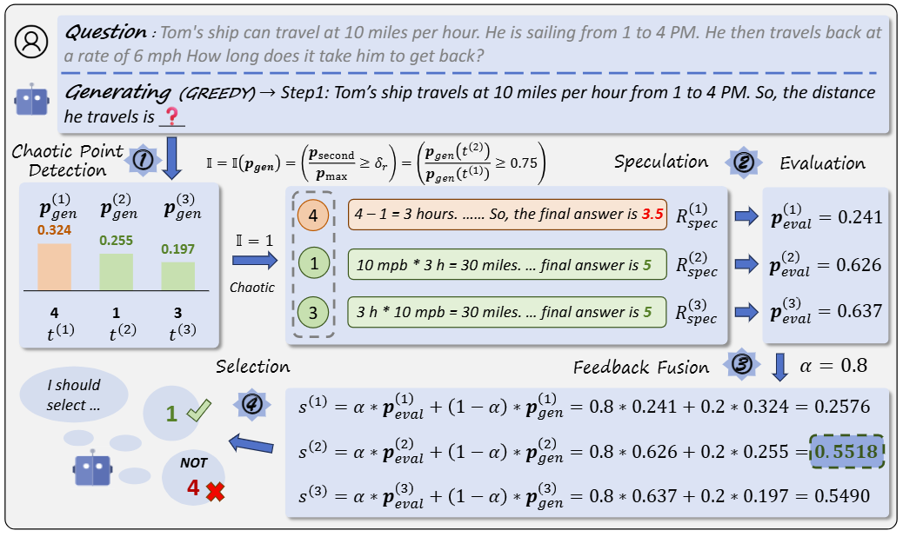

# DEval: Enhancing Large Language Models' Decoding with Evaluation for Better Generation
This is the relevant code repository for reproducing the models and pipeline described in *DEval: Enhancing Large Language Models' Decoding with Evaluation for Better Generation*.

## Framework
<p align="center">
    <br>
    
      <figcaption style="text-align: center;"> Algorithm process for Self-Evaluation Decoding. </figcaption>
    <br>
</p>

**Brief summary**

For each token $t_i$ that Model $\mathcal{M}$ will generate: ( line 3 )

1. calculate the token distribution $\mathbb{P}_i$ ( line 4 )
2. check whether $t_i$ is chaotic. ( line 5-6 )
3. If so, apply **DEval** on $\mathcal{M}$ to determine $t_i$. ( line 6-11 )
4. If not, select $t_i$ through standard decoding method. ( line 12-13 )
5. update the context. (`generated_tokens.append`) ( line 15 )

The following figure depicts the details of Step **3** through one real case. 👇👇👇

<p align="center">
    <br>
    
      <figcaption style="text-align: center;"> The workflow  of token selection at ONE chaotic point during decoding. 
Other chaotic points also follow a similar process. </figcaption>
    <br>
</p>

illustration: ratio-based detection, $\delta = 0.75$, $k = 3$


## Data Augmentation
We show how the augmented datasets are constructed in `./gsm8k_data_gen` and `./hotpotqa_data_gen`.
The former employs *few-shot* for data construction, whereas the latter utilizes *zero shot*.
For dataset [XieZhi](https://github.com/MikeGu721/XiezhiBenchmark), the pipeline is quite similar to GSM8k with nuanced differences.
You can make minor changes to the relevant code in `./gsm8k_data_gen` to obtain the augmented data for XieZhi.

For `./gsm8k_data_gen` and `./hotpotqa_data_gen`:
1. obtain [train.jsonl](https://huggingface.co/datasets/gsm8k) for GSM8K and the HotpotQA subset of [MRQA 2019](https://huggingface.co/datasets/mrqa) for HotpotQA.
2. Execute `1_xxx.py`, `2_xxx.py` and the rest programs sequentially according to the index number at the beginning of the name. Note, the output of the pre program serves as input for subsequent programs.

Following the steps above, you can obtain the augmented data for your specific dataset. 

Finally, you will obtain data in two formats:

1. $(q, a)$ for training LLMs' generation ability.  ($\mathcal{D}_{gen}$)
2. $(q, a, j)$ for training LLMs' evaluation ability. ($\mathcal{D}_{eval}$)


There are three examples for explanation:

**(q, a)**
```
# raw (q, a) data
(
  "It was reported that 2000 cases of Coronavirus had been confirmed in the state of New York in May 2020. There was half the number of cases in California, which had 400 more cases than the state of Texas. What's the total number of cases that had been confirmed in all of these states?",
  "Step1: It was reported that 2000 cases of Coronavirus had been confirmed in the state of New York in May 2020. \nStep2: There was half the number of cases in California, which means California had 2000/2 = 1000 cases.\nStep3: California had 400 more cases than the state of Texas, so Texas had 1000 - 400 = 600 cases.\nStep4: To find the total number of cases that had been confirmed in all of these states, we add the number of cases in each state: 2000 + 1000 + 600 = 3600.\nSo, the final answer is $3600."
)
# (q,a) data for training
{
  "instruction": "Given the following math question, answer it through step-by-step reasoning.\n---\nQuestion: It was reported that 2000 cases of Coronavirus had been confirmed in the state of New York in May 2020. There was half the number of cases in California, which had 400 more cases than the state of Texas. What's the total number of cases that had been confirmed in all of these states?\n---\n\nAnswer: ",
  "input": "",
  "output": "Step1: It was reported that 2000 cases of Coronavirus had been confirmed in the state of New York in May 2020. \nStep2: There was half the number of cases in California, which means California had 2000/2 = 1000 cases.\nStep3: California had 400 more cases than the state of Texas, so Texas had 1000 - 400 = 600 cases.\nStep4: To find the total number of cases that had been confirmed in all of these states, we add the number of cases in each state: 2000 + 1000 + 600 = 3600.\nSo, the final answer is $3600."
}
```


**(q, a, j)**
```
# raw (q, a, j) data
(
  "To make pizza, together with other ingredients, Kimber needs 10 cups of water, 16 cups of flour, and 1/2 times as many teaspoons of salt as the number of cups of flour. Calculate the combined total number of cups of water, flour, and teaspoons of salt that she needs to make the pizza.",
  "\n\nStep1: Kimber needs 10 cups of water.\nStep2: Kimber needs 16 cups of flour.\nStep3: Kimber needs 1/2 times as many teaspoons of salt as the number of cups of flour. So, she needs 1/2 * 16 = 8 teaspoons of salt.\nStep4: To find the combined total number of cups of water, flour, and teaspoons of salt, we add them together: 10 cups of water + 16 cups of flour + 8 teaspoons of salt.\nStep5: Since there are 16 teaspoons in 1 cup, we convert the teaspoons of salt to cups: 8 teaspoons of salt = 8/16 = 1/2 cup of salt.\nStep6: Now, we add the cups of water, flour, and salt: 10 cups of water + 16 cups of flour + 1/2 cup of salt = 26.5 cups.\nSo, the final answer is $26.5.",
  0
)
# (q, a, j) data for training
{
  "instruction": "Judge the correctness of the answer in the following Q&A scenario:\n###\nGiven the following math question, answer it through step-by-step reasoning.\n---\nQuestion: To make pizza, together with other ingredients, Kimber needs 10 cups of water, 16 cups of flour, and 1/2 times as many teaspoons of salt as the number of cups of flour. Calculate the combined total number of cups of water, flour, and teaspoons of salt that she needs to make the pizza.\n---\n\nAnswer:  \n\nStep1: Kimber needs 10 cups of water.\nStep2: Kimber needs 16 cups of flour.\nStep3: Kimber needs 1/2 times as many teaspoons of salt as the number of cups of flour. So, she needs 1/2 * 16 = 8 teaspoons of salt.\nStep4: To find the combined total number of cups of water, flour, and teaspoons of salt, we add them together: 10 cups of water + 16 cups of flour + 8 teaspoons of salt.\nStep5: Since there are 16 teaspoons in 1 cup, we convert the teaspoons of salt to cups: 8 teaspoons of salt = 8/16 = 1/2 cup of salt.\nStep6: Now, we add the cups of water, flour, and salt: 10 cups of water + 16 cups of flour + 1/2 cup of salt = 26.5 cups.\nSo, the final answer is $26.5.\n###\n\nJudge: ",
  "input": "",
  "output": "[[N]], the answer is incorrect.",
}
```


## Training
We utilize the [KW-CutGPT](https://huggingface.co/XuYipei/kw-cutegpt-13b-ift) training script for supervised fine-tuning. 

You may refer to this [instruction](https://github.com/Abbey4799/CuteGPT/blob/main/README.md) to reproduce this work.


## Self-Evaluation Decoding
`logits_processor_utils.py` implements Self-Evaluation Decoding through `LogitsProcessor` class, which is explained in related [HuggingFace Document](https://huggingface.co/docs/transformers/v4.41.2/en/internal/generation_utils#logitsprocessor). 

`logits_processor_utils.py` exactly follows the framework of **Algorithm 1** mentioned above. 
It takes the generated tokens and the predicted logits of the current token as inputs, and the modified logits as outputs to control the token selection.
You may refer to it for more details.

## Inference
The model inference on three datasets follows the same process. 
Here we take GSM8K as an example. 
`infer.py` is the corresponding source code, mainly consisting of three modules.

1. **read data.** Read test dataset. Parse the data into prompts and labels. The former is used for model inference, while the latter is used for evaluation.
2. **inference.** First, initialize the model. Then select the decoding method for the model based on the command line parameters. Finally, use the model for inference.
3. **evaluation.** Extract answers from the model responses and compare them with the labels to calculate the accuracy.

Step 2 explains how to apply SED to inference.
You may refer to `infer.py` for more details.


## Related Prompt Templates

### Data Augmentation Prompts

**XieZhi**
```
Select the answer to the target question from the options based on the knowledge you have learned.

There are some examples that you can refer to: 
---
{demonstrations}
---

You should answer the following question in a similar way to the examples above:
Question: {question_and_options}
Answer: 
```
**HotpotQA**
```
You are professional at reading comprehension. 

The following is one or several reference documents for you to comprehend and memory:
---
{reference_docs}
---

The answer to the following question can be inferred through the above reference(s).
Question: {question}

Provide the answer to the given question through step-by-step reasoning. After your reasoning, output your final answer in the format of [[YOUR ANSWER]].
make sure the final answer is enclosed by the double square brackets.

Let's think step by step.
```
**GSM8K**
```
Please help me solve the math problem step by step. You must give your final answer at the end of response like `So, the final answer is \$ your answer'. I will provide examples for you:

---
{demonstrations}
---

Next, please answer this math problem:
Question: {question}
Answer: 
```

### Inference

**XieZhi**
```
Select the answer to the question from the options based on the knowledge you have learned.
Question: {question}
Options: {options}
Answer: 
```
**HotpotQA**
```
Given the context and question, answer the question through step-by-step reasoning based on the context.
---
Context: {reference_docs}

Question: {question}
---

Answer: 
```
**GSM8K**
```
Given the following math question, answer it through step-by-step reasoning.
---
Question: {question}
---

Answer: 
```

### Evaluation

Unified prompt template for **XieZhi**, **HotpotQA**, and **GSM8K**.

```
Judge the correctness of the answer in the following Q&A scenario:
###
{model_response}
###

Judge: 
```
